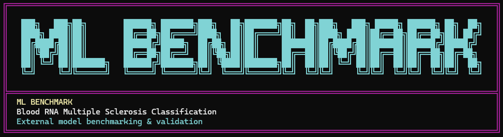

<p align="center">
  
</p>

<h1 align="center">MS Blood RNA ML Benchmark</h1>

<p align="center">
  A reproducible benchmark for classifying <b>Multiple Sclerosis</b> from whole-blood RNA expression,
  with a clinically weighted composite metric — the <b>MS Research Score</b>.
</p>

<p align="center">
  
  
  
  
</p>

> **Preprint:** {link to be added}

---

## What this is

Machine-learning studies in biomedicine are usually reported through a single number — accuracy or AUC.
In a clinical setting those numbers carry different weight. This benchmark evaluates a panel of models on the
public **GSE17048** cohort under one standardized, leakage-safe pipeline, and summarizes each model with a
composite **MS Research Score** that combines discrimination, sensitivity, precision, and calibration.

Drop in your own model, run one command, and see exactly where it lands against the published panel.

> ⚠️ **Research use only.** The MS Research Score is exploratory, not a validated clinical instrument.
> Nothing here is for diagnosis or medical decision-making.

---

## Quickstart

```bash
git clone https://github.com/adamjamiesimson/Blood-RNA-ML-benchmark.git
cd Blood-RNA-ML-benchmark

python -m venv .venv && source .venv/bin/activate   # Windows: .venv\Scripts\activate
pip install -r requirements.txt

python run_benchmark.py
```

The dataset ships with the repo (`data/GSE17048_series_matrix.txt.gz`), so there is nothing else to download.
Outputs are written to `results/`.

> On macOS, XGBoost needs OpenMP: `brew install libomp`. Without it the benchmark simply skips XGBoost.

### Benchmark your own model

```bash
python run_benchmark.py --external-models examples/external_models.py
```

Your model is run through the same pipeline, tuned with the same nested CV, and scored alongside the panel.
See [`examples/external_models.py`](examples/external_models.py) for the two accepted formats (an
`EXTERNAL_MODELS` dict, or pretrained `.joblib`/`.pkl` files).

---

## The MS Research Score

A single number in `[0, 100]` combining six per-model metrics. Higher is better; the calibration term uses
`1 − Brier`.

| Component   | Weight |
|-------------|:------:|
| AUC-ROC     |  25%   |
| Sensitivity |  25%   |
| PR-AUC      |  15%   |
| Specificity |  15%   |
| F1          |  10%   |
| Calibration |  10%   |

The weights live in [`msbench/config.py`](msbench/config.py) — change them there and every output updates.

---

## Models

Nine estimators are evaluated out of the box:

Logistic Regression · SVM · Random Forest · Gradient Boosting · XGBoost ·
Neural Network (MLP) · Naive Bayes · KNN · Stacking Ensemble

Each runs inside a leakage-safe pipeline: median imputation → top-variance filtering → standardization →
supervised `SelectKBest` → SMOTE (train folds only) → estimator. Every fitted step sees only training data.

---

## Evaluation pipeline

- **Nested cross-validation** — outer folds estimate performance, inner folds tune hyperparameters.
- **Held-out test set** — a stratified 20% split for a single final evaluation.
- **Bootstrap 95% CIs** — for AUC, sensitivity, and specificity.
- **ROC, calibration, and leaderboard figures** — publication-style PNGs.

---

## Dataset

**GSE17048 — Whole Blood RNA Expression Profiles** ·
[NCBI GEO](https://www.ncbi.nlm.nih.gov/geo/query/acc.cgi?acc=GSE17048)

144 samples: healthy controls plus relapsing-remitting, primary-progressive, and secondary-progressive MS.
For the binary task, all MS subtypes are collapsed to a single positive class (`1 = MS`, `0 = HC`).
Details in [`data/README.md`](data/README.md).

---

## Repository layout

```
Blood-RNA-ML-benchmark/
├── run_benchmark.py          # CLI entry point
├── msbench/                  # benchmark package
│   ├── config.py             # settings + score weights
│   ├── data.py               # GEO series-matrix loader
│   ├── models.py             # pipeline, model registry, external-model loading
│   ├── metrics.py            # metrics, MS Research Score, bootstrap CIs
│   ├── benchmark.py          # nested CV, holdout, stacking, orchestration
│   ├── plots.py              # figures
│   └── banner.py             # CLI banner
├── data/                     # GSE17048 series matrix
├── examples/                 # bring-your-own-model template
├── results/                  # sample outputs (overwritten on each run)
├── docs/                     # figures and model notes
├── requirements.txt
└── pyproject.toml            # `pip install -e .` → `msbench` command
```

Installing the package (`pip install -e .`) exposes the same run as a console command:

```bash
msbench --help
```

---

## Configuration

Everything is overridable from the CLI (`python run_benchmark.py --help`):

| Flag | Default | Purpose |
|------|:-------:|---------|
| `--data-file` | `data/GSE17048_series_matrix.txt.gz` | Input series matrix |
| `--results-dir` | `results` | Output directory |
| `--test-size` | `0.20` | Holdout fraction |
| `--outer-cv-folds` / `--inner-cv-folds` | `5` / `3` | Nested CV folds |
| `--n-bootstrap` | `2000` | Bootstrap resamples for CIs |
| `--top-variance` / `--k-best-features` | `1000` / `200` | Feature selection sizes |
| `--external-models` | — | Path to your models |

---

## Outputs

Written to `results/` — see [`results/README.md`](results/README.md) for the full column reference.

| File | Contents |
|------|----------|
| `nested_cv_summary.csv` | Pooled nested-CV metrics per model |
| `nested_cv_fold_results.csv` | Per-fold detail |
| `holdout_test_results.csv` | Final held-out metrics + 95% CIs |
| `holdout_predictions.csv` | Per-sample predictions |
| `ms_research_score_leaderboard.png` | Ranked score bar chart |
| `holdout_metrics_heatmap.png` | Metric heatmap |
| `holdout_roc_curves.png` | ROC curves |
| `run_metadata.json` | Config, environment, score weights |

---

## Authors

**Adam Simson** and **Ankush Dutta** — Synthica Research Group.

## License

MIT — see [LICENSE](LICENSE).

## Disclaimer

For research and educational use only. Not intended for clinical use, diagnosis, or medical decision-making.
